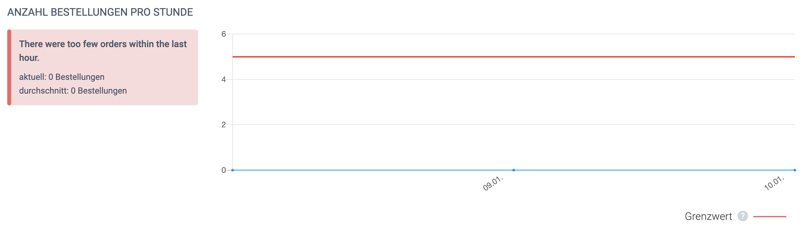
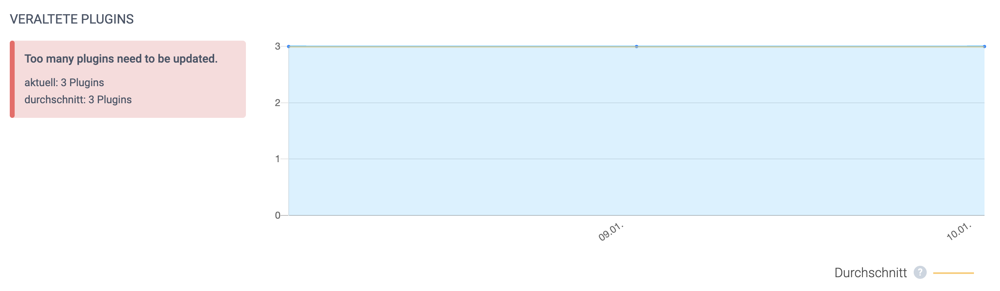

This plugin is still experimental and can not be used yet. But as it is open source feel free to help us making it better and easier to integrate Shopware with koality.io.

# koality.io Shopware6 Plugin

This plugin can be used to continuously monitor a Shopware shop for business metrics. Our idea of [how to monitor a Shopware shop](https://www.koality.io/de/magazin/de/articles/ecommerce/shopware-monitoring) can be found in our magazin. 

## Layout (koality.io / abstract)





## Metrics

The following metrics are implemented yet:

- **Minimum orders per hour** - this check fails if the number of orders within the last hour falls under a given threshold. The check provides two time intervals. Rush hour and normal shopping time. This is needed to minimize false positives.


- **Maximum number of open carts** - fails if there are to many open carts. This often happens if the payment fails, and the customers can't finish the buying process.


- **Minimum number of active products** - this check fails if there are not enough active products in the should. This will help find import errors.


- **Maximum number of updatable plugin** - this check fails if there are too many plugins that need an update. This will help find security issues.

## How the plugin works

The plugin provides a JSON endpoint for the Shopware storefront that is secured via a secret token. The endpoint returns the health status of the shop. The health status is a mix of business metrics like "orders per hour" or server metrics like "space left on device".

### Example
```json
{
    "status": "fail",
    "output": "Some Shopware6 health metrics failed: ",
    "checks": {
        "carts.open.too_many": {
            "status": "fail",
            "output": "There are too many open carts at the moment.",
            "limit": 30,
            "limitType": "max",
            "observedValue": 60,
            "observedUnit": "carts",
            "metricType": "time_series_numeric"
        },
        "products.active": {
            "status": "pass",
            "output": "There are enough active products in your shop.",
            "limit": 0,
            "limitType": "min",
            "observedValue": 1,
            "observedUnit": "products",
            "metricType": "time_series_numeric"
        },
        "plugins.updatable": {
            "status": "pass",
            "output": "Not too many plugins need to be updated.",
            "limit": 0,
            "limitType": "max",
            "observedValue": 0,
            "observedUnit": "plugins",
            "metricType": "time_series_numeric"
        },
        "orders.too_few": {
            "status": "fail",
            "output": "There were too few orders within the last hour.",
            "limit": 20,
            "limitType": "min",
            "observedValue": 0,
            "observedUnit": "orders",
            "metricType": "time_series_numeric"
        }
    },
    "info": {
        "creator": "koality.io Shopware Plugin",
        "version": "1.0.0",
        "plugin_url": "https:\/\/www.koality.io\/plugins\/shopware"
    }
}
```

koality.io can interpret this format and will alert if a check fails. At the moment it is needed that the fail or pass decision is made in the Shopware backend. In future versions this can be done in koality.io.

The API endpoint can be found here after installation:
```
https://myshop.com/_koality/sales/metrics/<api_key>
```

The format of the Shopware health endpoint is implementing this standard (still RFC):
```
https://tools.ietf.org/html/draft-inadarei-api-health-check-05
```

## Configuration

For configuration, we are using the [Shopware 6 config.xml file](https://docs.shopware.com/en/shopware-platform-dev-en/references-internals/plugins/plugin-config)
.

## Todo

At the moment this plugin is only a proof of concept. We would be happy if Shopware 6 experts will refactor it to be the best monitoring plugin for the favourite e-commerce solution.


- Check if Shopware needs an update


- Upload the plugin to the Shopware marketplace.


- I18n: the plugin should exist in german and english.


- ~~Check if a plugin needs an update~~


- ~~The result JSON must be 100 % compatible with the IETF health check format.~~


- ~~Complete the descriptions in the config.xml file~~


- ~~Add licence~~

## Frequently asked questions

- **Does the plugin also work for Leankoala?** Yes, it will produce an IETF compatible health check output that can be read by Leankoala as well.


- **Will there be a Shopware5 plugin as well?** Yes, but at first we will implement the current gen versions auf the most used shop frameworks.


- **Can I implement a plugin on my own?** Sure, just give us a call and we provide you with all the information you need.
